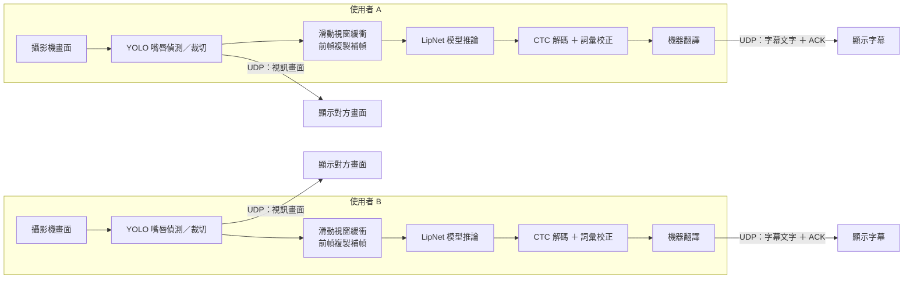

# LipNet 唇語辨識模型輕量化研究

大學專題，以 [LipNet](https://arxiv.org/abs/1611.01599) 唇語辨識模型為基礎，目標是在**不犧牲準確率的前提下**，讓模型能在沒有獨立顯卡的低階裝置上流暢運行，服務聽障人士於吵雜或無法聽清聲音環境下的溝通需求。

## 研究方法

拆成兩個獨立實驗：

1. **通道數減半**：把 Conv3D 各層卷積通道數減半，驗證架構輕量化對速度與準確率的影響。
2. **CPU 部署格式轉換**：把已輕量化模型轉換成 ONNX、TFLite 等格式，驗證格式轉換對速度與準確率的影響。

## 主要成果

| 階段 | CPU 推論耗時 | 相對加速 |
|---|---|---|
| 上一屆模型 | 662.6 ms | 1.00× |
| 通道數減半後 | 300.3 ms | 快 2.2 倍 |
| 再轉換為 ONNX float32 | 158.1 ms | **快 4.2 倍** |

全部說話者整句正確率達 **94.9%**，格式轉換與量化均未明顯犧牲辨識準確率。

CPU 部署格式完整比較：

| 格式 | CPU耗時 | 相對.h5倍率 | WER校正前 | WER校正後 |
|---|---|---|---|---|
| .h5 | 300.3 ms | 1.00× | 13.6% | 1.4% |
| TFLite float32 | 2607.8 ms | 慢8.7倍 | 13.5% | 1.2% |
| TFLite INT8 | 2350.3 ms | 慢7.8倍 | 13.5% | 1.2% |
| **ONNX float32** | **158.1 ms** | **快1.9倍** | 13.0% | 0.8% |
| ONNX INT8 | 155.5 ms | 快1.9倍 | 13.1% | 0.8% |

ONNX 因對模型使用的運算子有原生支援可直接硬體加速而大幅領先；TFLite 因內建運算子集不完整支援 Conv3D/MaxPool3D，需退回 TensorFlow 引擎執行反而更慢。

## 系統

發射端／接收端即時通話系統，攝影機畫面經 YOLO 嘴唇偵測、裁切、送入 LipNet 模型推論，透過 CTC 解碼與詞彙校正產生字幕文字。已封裝為可獨立執行的應用程式。

### 系統架構圖



雙方為對稱架構，各自在本機完成「偵測→辨識→解碼」，只透過 UDP 傳送視訊畫面與最終字幕文字，因此可在無獨立顯卡的低階裝置上雙向運作。

## 資料夾結構

```
camera_system/   即時通話系統
scripts/         模型訓練、資料快取重製、匯出、診斷等核心腳本
benchmark/       各版本模型的 WER／CPU 速度 benchmark 腳本
```

> 模型權重檔、訓練資料快取、影片檔案體積龐大，未包含於此 repo。

## 參考文獻

僅列上過國際會議之文獻：

- Ma, P., Martinez, B., Petridis, S., & Pantic, M. *Towards Practical Lipreading with Distilled and Efficient Models.* **ICASSP 2021.** arXiv:2007.06504.
- *LiteVSR: Efficient Visual Speech Recognition by Learning from Speech Representations of Unlabeled Data.* **ICASSP 2024.** arXiv:2312.09727.
- *A Lightweight Lip-Reading Model with Image Difference Fusion.* **WCI3DT 2024.**
