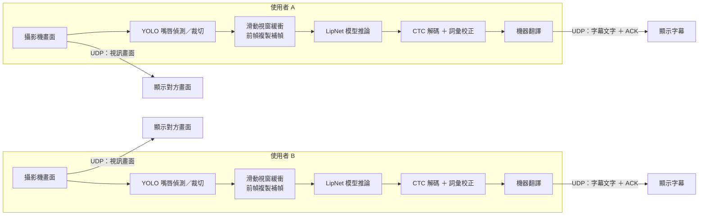

# LipNet 唇語辨識模型輕量化研究

以 [LipNet](https://arxiv.org/abs/1611.01599) 唇語辨識模型為基礎，目標是在**不犧牲準確率的前提下**，讓模型能在沒有獨立顯卡的低階裝置上流暢運行，服務聽障人士於吵雜或無法聽清聲音環境下的溝通需求。


## 研究方法

拆成兩個獨立實驗：

1. **通道數減半**：把 Conv3D 各層卷積通道數減半，驗證架構輕量化對速度與準確率的影響。
2. **CPU 部署格式轉換**：把已輕量化模型轉換成 ONNX、TFLite 等格式，驗證格式轉換對速度與準確率的影響。

基準模型（`model_bn`）架構：

```
Conv3D(128) → BN → ReLU → MaxPool
Conv3D(256) → BN → ReLU → MaxPool
Conv3D(75)  → BN → ReLU → MaxPool
→ 攤平 → BiLSTM(128) x2 → Dense → CTC
```

兩種輕量化改法：

- **深度可分離卷積**：用 TensorFlow `Conv3D` 的 `groups` 參數，把第二、三層拆成深度卷積＋逐點卷積兩步驟，第一層（單一灰階通道）維持標準卷積。
- **寬度縮放（F_Width0.5）**：三層卷積輸出通道數全部乘以 0.5，是改動最小的輕量化做法。

程式碼在 `model_experiment.py` 的 `model_bn_dsconv()` 和 `model_bn_width()`。

## 實驗結果

### 小規模架構比較

用 GRID s1（80筆資料）跑 15 epoch，比較 6 個模型架構的訓練效率與 loss 下降趨勢：

| 模型 | 參數量 | 每epoch耗時(秒) | 最低loss | 相對基準參數量比例 | 相對基準訓練速度 |
|---|---|---|---|---|---|
| A_Original | 8,471,924 | 11.30 | 71.21 | — | — |
| C_BN（基準） | 8,473,760 | 14.45 | 71.63 | 100% | 1.00× |
| D_BN_Drop | 8,473,760 | 14.85 | 72.10 | 100% | 0.97× |
| E_DSConv | 7,134,880 | 8.48 | 70.12 | 84.2% | 1.70× |
| F_Width0.5 | 4,109,282 | 6.55 | 70.53 | 48.5% | 2.21× |

兩個輕量化架構參數量減少 15.8%～51.5%，訓練速度提升 1.7～2.2 倍，loss 也略低於基準，因此挑選 F_Width0.5 搬進正式訓練流程。

### 正式訓練（完整資料集）

用跟上一屆模型（v11）相同的 16 位說話者、完整資料集（10,861支影片）重新訓練 F_Width0.5。因為是全新架構、無法載入舊權重，只能從零開始訓練。

第一輪 15 epoch 後，12 位說話者加權平均正確率僅 3.8%（v11 為 67.9%），val_loss 仍持續下降未收斂。接續訓練到 35 epoch 後：

| 說話者 | width05（35epoch） | v11 | 差異 |
|---|---|---|---|
| s99_1 | 48.6% | 99.9% | -51.3% |
| s99_6 | 98.0% | 100.0% | -2.0% |
| s99_7 | 94.2% | 100.0% | -5.8% |
| s99_8 | 92.9% | 100.0% | -7.1% |
| s99_3+5 | 0.0% | 0.0% | +0.0% |
| s34_3 | 26.1% | 78.4% | -52.3% |
| GRID s1 | 45.0% | 49.2% | -4.2% |
| GRID s2 | 1.9% | 10.6% | -8.7% |
| GRID s5 | 45.9% | 67.5% | -21.6% |
| GRID s6 | 77.8% | 94.9% | -17.1% |
| GRID s7 | 60.4% | 85.6% | -25.2% |
| GRID s13 | 15.7% | 46.2% | -30.5% |
| 加權平均 | 46.2% | 67.9% | -21.7% |

只多訓練 20 輪，加權平均從 3.8% 提升到 46.2%，差距從 -64.1% 收斂到 -21.7%，證實 F_Width0.5 架構本身沒有劣勢，早期落後只是訓練輪數不足。

## 主要成果

| 階段 | CPU 推論耗時 | 相對加速 |
|---|---|---|
| 上一屆模型 | 662.6 ms | 1.00× |
| 通道數減半後 | 300.3 ms | 快 2.2 倍 |
| 再轉換為 ONNX float32 | 158.1 ms | **快 4.2 倍** |

全部說話者整句正確率達 **94.9%**，格式轉換與量化均未明顯犧牲辨識準確率。

CPU 部署格式完整比較：

| 格式 | CPU耗時 | 相對.h5倍率 | WER校正前 | WER校正後 |
|---|---|---|---|---|
| .h5 | 300.3 ms | 1.00× | 13.6% | 1.4% |
| TFLite float32 | 2607.8 ms | 慢8.7倍 | 13.5% | 1.2% |
| TFLite INT8 | 2350.3 ms | 慢7.8倍 | 13.5% | 1.2% |
| **ONNX float32** | **158.1 ms** | **快1.9倍** | 13.0% | 0.8% |
| ONNX INT8 | 155.5 ms | 快1.9倍 | 13.1% | 0.8% |

ONNX 因對模型使用的運算子有原生支援可直接硬體加速而大幅領先；TFLite 因內建運算子集不完整支援 Conv3D/MaxPool3D，需退回 TensorFlow 引擎執行反而更慢。

### 量化原理

量化是把模型內部計算用的數字精度，從 32 位元浮點數（float32）降到 8 位元整數（INT8），理論上能讓模型檔案變小、計算更快。

實驗發現量化幾乎不影響準確率（同格式下 float32 跟 INT8 的 WER 只差在 0.1 個百分點內），但也沒有帶來明顯加速（ONNX INT8 只比 float32 快 1.7%，TFLite INT8 同樣只快一點點）。真正決定速度的是「格式」本身，量化只是在同一個格式裡再做一次小幅壓縮。

「架構輕量化」（砍通道數）跟「部署格式轉換＋量化」是兩件獨立的事：前者才是讓模型真正變小變快的原因，後者只決定同一個輕量化模型在不同格式下的實際執行速度。

## 系統

發射端／接收端即時通話系統，攝影機畫面經 YOLO 嘴唇偵測、裁切、送入 LipNet 模型推論，透過 CTC 解碼與詞彙校正產生字幕文字。已封裝為可獨立執行的應用程式。

### 系統架構圖



雙方為對稱架構，各自在本機完成「偵測→辨識→解碼」，只透過 UDP 傳送視訊畫面與最終字幕文字，因此可在無獨立顯卡的低階裝置上雙向運作。視訊畫面傳輸取自原始攝影機畫面（未經 YOLO 裁切），與 LipNet 辨識管線是兩條互相獨立的路徑，僅供對方顯示原始畫面用，不會被拿去做辨識推論。

## 參考文獻

- Assael, Y. M., Shillingford, B., Whiteson, S., & de Freitas, N. *LipNet: End-to-End Sentence-level Lipreading.* arXiv:1611.01599.
- Ma, P., Martinez, B., Petridis, S., & Pantic, M. *Towards Practical Lipreading with Distilled and Efficient Models.* **ICASSP 2021.** arXiv:2007.06504.
- *LiteVSR: Efficient Visual Speech Recognition by Learning from Speech Representations of Unlabeled Data.* **ICASSP 2024.** arXiv:2312.09727.
- *A Lightweight Lip-Reading Model with Image Difference Fusion.* **WCI3DT 2024.**
