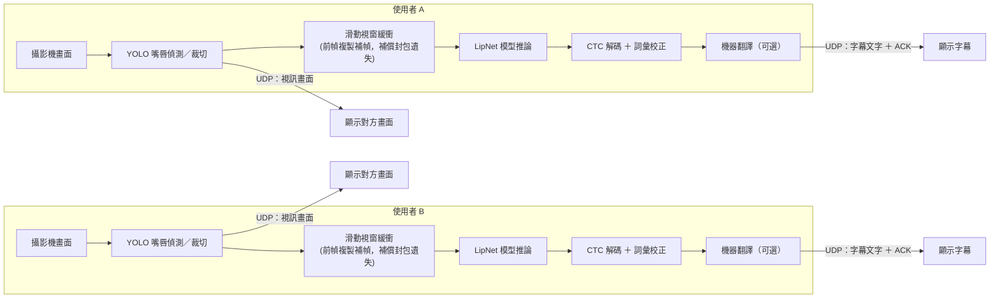

# LipNet 唇語辨識模型輕量化研究

大學專題，以 [LipNet](https://arxiv.org/abs/1611.01599)（Assael et al., 2016）唇語辨識模型為基礎，目標是在**不犧牲準確率的前提下**，讓模型能在沒有獨立顯卡的低階裝置（如舊筆電）上流暢運行，服務聽障人士於吵雜或無法聽清聲音環境下的溝通需求。

## 研究方法

拆成兩個獨立實驗：

1. **通道數減半（F_Width0.5 架構）**：把 Conv3D 各層卷積通道數減半，層數與深度不變，驗證架構輕量化對速度與準確率的影響。
2. **CPU 部署格式轉換**：把已輕量化模型轉換成 ONNX、TFLite 等格式，並比較是否量化（float32 / INT8），驗證格式轉換對速度與準確率的影響。

## 主要成果

| 階段 | CPU 推論耗時 | 相對加速 |
|---|---|---|
| 上一屆模型（原始格式） | 662.6 ms | 1.00× |
| 通道數減半後（.h5） | 300.3 ms | 快 2.2 倍 |
| 再轉換為 ONNX float32 | 158.1 ms | **快 4.2 倍** |

全部說話者（GRID 語料庫六位官方說話者＋非GRID自建說話者，共 7,925 筆）整句正確率達 **94.9%**，格式轉換與量化均未明顯犧牲辨識準確率。

CPU 部署格式完整比較（GRID 六位說話者全量測試，n=5,986）：

| 格式 | CPU耗時 | 相對.h5倍率 | WER校正前 | WER校正後 |
|---|---|---|---|---|
| .h5（原始格式） | 300.3 ms | 1.00× | 13.6% | 1.4% |
| TFLite float32 | 2607.8 ms | 慢8.7倍 | 13.5% | 1.2% |
| TFLite INT8 | 2350.3 ms | 慢7.8倍 | 13.5% | 1.2% |
| **ONNX float32** | **158.1 ms** | **快1.9倍** | 13.0% | 0.8% |
| ONNX INT8 | 155.5 ms | 快1.9倍 | 13.1% | 0.8% |

ONNX 因對模型使用的運算子有原生支援可直接硬體加速而大幅領先；TFLite 因內建運算子集不完整支援 Conv3D/MaxPool3D，需退回 TensorFlow 引擎執行反而更慢。

## 系統

發射端／接收端即時通話系統，攝影機畫面經 YOLO 嘴唇偵測、裁切、送入 LipNet 模型推論，透過 CTC 解碼與詞彙校正產生字幕文字。已封裝為可獨立執行的應用程式（PyInstaller）。

### 系統架構圖



雙方為對稱架構，各自在本機完成「偵測→辨識→解碼」，只透過 UDP 傳送視訊畫面與最終字幕文字（非傳送原始語音辨識負擔），因此可在無獨立顯卡的低階裝置上雙向運作。

## 資料夾結構

```
camera_system/   即時通話系統（發射端/接收端 GUI 應用程式原始碼）
scripts/         模型訓練、資料快取重製、匯出、診斷等核心腳本
benchmark/       各版本模型的 WER／CPU 速度 benchmark 腳本
```

> 模型權重檔（.h5/.onnx/.tflite）、訓練資料快取、影片檔案體積龐大，未包含於此 repo。

## 參考文獻

**基礎模型**

- Assael, Y. M., Shillingford, B., Whiteson, S., & de Freitas, N. (2016). *LipNet: End-to-End Sentence-level Lipreading.* arXiv:1611.01599.

**應用案例**

- 三浦典之、御堂義博、猪原秀典（大阪大學）(2024). *Lip2ja：口唇映像による日本語の発話.* 第75回日本気管食道科学会総会・学術講演会発表。喉癌／下咽頭癌術後失聲病人適用，精度約60%，已進入臨床試驗，官方仍表示「急需可離線運作於手機／平板的版本」。https://resou.osaka-u.ac.jp/ja/research/2024/20241015_3

**輕量化方法參考**

- *Towards Practical Lipreading with Distilled and Efficient Models.* arXiv:2007.06504. （深度可分離卷積＋自蒸餾壓縮唇語模型，LRW 資料集上參數量可縮 4～17 倍、準確度幾乎不掉）
- *LiteVSR: Efficient Visual Speech Recognition.* arXiv:2312.09727. （RWTH Aachen University，用語音 ASR 模型知識蒸餾出輕量視覺模型，CPU 上可即時推論）
- *A Lightweight Lip-Reading Model with Image Difference Fusion.*（重慶科技大學，以更省算的架構取代 3D CNN）

**幀率與模型比較相關**

- 岐阜大學・Ricoh. *フレームレートと解像度がLip Readingの認識率に与える影響.*（研究幀率／解析度對唇語辨識準確率的影響，與本專題前幀複製補幀實驗主題高度重疊）
- 九州工業大學. *読唇に有効な深層学習モデルの検討.*（比較 WideResNet／EfficientNet／Transformer 於唇語辨識任務的表現）
